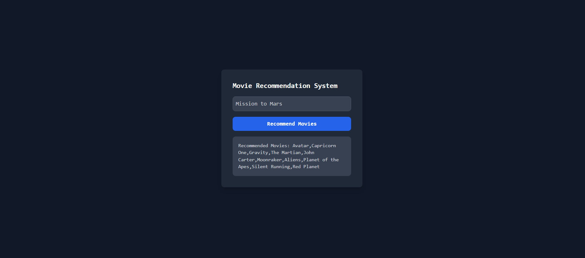

# Movie Recommendation System

This project implements a **Movie Recommendation System** using advanced natural language processing techniques and a responsive web application built with **Flask** and **React**.

## 🔑 Key Features:

- **Content-Based Filtering**: Recommends movies based on metadata similarity (genres, cast, crew, etc.).
- **TF-IDF Vectorizer**: Utilized for vectorizing metadata, producing superior recommendation quality compared to CountVectorizer.
- **Cosine Similarity**: Calculates similarity scores between movies for recommendations.
- **Dataset Preprocessing**: Cleaned and enhanced a comprehensive movie dataset from **Kaggle**.
- **Web Interface**: Built with **React** for user interaction and **Flask** for backend processing.

## 🗂️ Dataset

The dataset was sourced from **Kaggle** and contains:

- Movie titles
- Genres
- Cast and crew details
- Overview
- Keywords

[Download the dataset](https://www.kaggle.com/datasets/tmdb/tmdb-movie-metadata)
